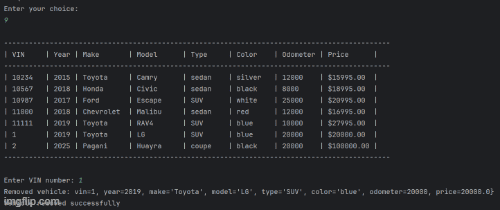

# Car Dealership Management System

## Description of the Project

The Car Dealership Management System is a Java console application that allows users to manage vehicle inventory for a car dealership. Users can search for vehicles using various filters (price, make/model, year, etc.), add new vehicles, remove existing ones, and view all available inventory.

A key feature is that all data is persisted through a CSV file, so the application loads dealership and vehicle information on startup and saves all changes after add/remove actions. This application is ideal for practicing file I/O, user interaction, object-oriented programming, and collection manipulation in Java.

[Class Diagram](ClassDiagram.png)

## User Stories

- As a dealership staff member, I want to view all vehicles in the inventory.
- As a staff member, I want to search for vehicles by price, make/model, year, color, mileage, or type.
- As a staff member, I want to add a new vehicle to the inventory so it appears in future searches.
- As a staff member, I want to remove a vehicle by VIN so that the inventory stays current.
- As a staff member, I want changes to be saved to a file so they persist between sessions.

## Setup

Instructions on how to set up and run the project using IntelliJ IDEA.

### Prerequisites

- IntelliJ IDEA: Download from [here](https://www.jetbrains.com/idea/download/).
- Java SDK 17+: Make sure Java SDK is installed and configured in IntelliJ.

### Running the Application in IntelliJ

1. Open IntelliJ IDEA.
2. Select **File → Open**, then locate and open the project folder.
3. Wait for IntelliJ to index the files.
4. Locate the `Program.java` file (contains the `main` method).
5. Right-click the file and select **Run 'Program.main()'** to launch the console menu.

## Technologies Used

- **Java 17+**: Core programming language
- `java.util.*`: ArrayList, Scanner
- `java.io.*`: BufferedReader, BufferedWriter, FileReader, FileWriter
- Object-Oriented Programming: Classes like `Vehicle`, `Dealership`, and `DealershipFileManager`
- File I/O: Reading from and writing to CSV file for inventory persistence

## Demo

## File Format

The file `dealership.csv` stores all dealership data.

- **First Line**: Contains dealership info → `Name,Address,Phone`
- **Remaining Lines**: Each line is a vehicle in the format:  
  `VIN|Make|Year|Model|VehicleType|Color|Odometer|Price`

Example:

## Future Enhancements

- Add a GUI using JavaFX or Swing
- Add logging functionality
- Add dealership authentication (password-protected admin access)
- Support multiple dealership branches (multi-file or database-backed)

## Resources

- [Java File I/O](https://docs.oracle.com/javase/tutorial/essential/io/)
- [Java Collections Framework](https://docs.oracle.com/javase/8/docs/technotes/guides/collections/overview.html)
- Instructor-provided materials and IntelliJ tutorials

## Team Members

- **Guriqbal Manyani** – Developer
- **Instructor: Raymond Maroun**

## Thanks

- Special thanks to **Raymond Maroun** for project guidance and feedback.
- Shoutout to classmates and peers who helped test and review the application.

